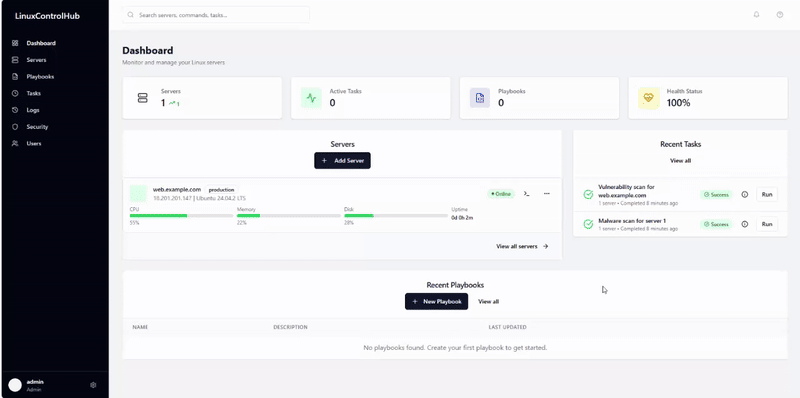
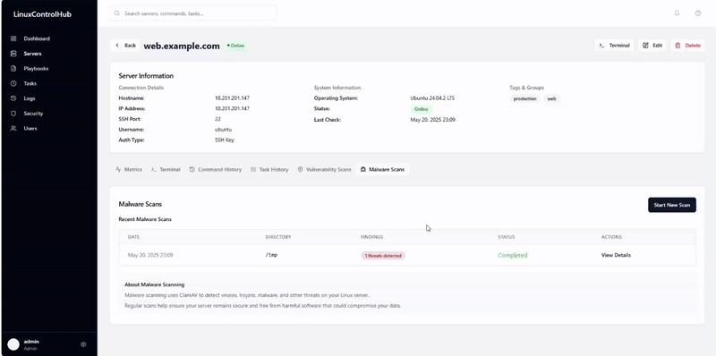
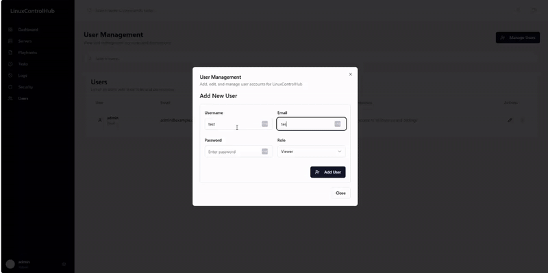

# LinuxControlHub

LinuxControlHub is a powerful web application for Linux server infrastructure management, providing advanced automation, task orchestration, and comprehensive server management capabilities.

> ⚠️ **This project is developed using _vibe coding_,  a rapid, intuitive development approach focused on shipping features fast. _Use at your own risk_. Carefully review the code and configurations before deploying in production.**

## 📖 Read the Story Behind This Project

Curious how this project was built using vibe coding and AI assistance?  
Check out the full article here:  
👉 [My Experience With Vibe Coding: Can AI Really Build a Server Management App?](https://www.linkedin.com/pulse/my-experience-vibe-coding-can-ai-really-build-server-app-torkey-03yee)


## Features

- **SSH Terminal Access**: Connect to your servers with in-browser terminal
- **Server Management**: Monitor and manage multiple Linux servers
- **Ansible Integration**: Run playbooks for automated configuration management
- **Task Scheduling**: Schedule commands and playbooks with cron expressions
- **Vulnerability Scanning**: Scan servers for security vulnerabilities using Vuls integration
- **Metrics Monitoring**: Track CPU, memory, disk, and load average
- **Role-Based Access Control**: Manage permissions with admin and user roles

## Screenshots

Below are some core features of LinuxControlHub in action:

### 🖥️ Dashboard Overview


### 🛡️ Malware Scan Result


### 👥 User Management


## Deployment Options

LinuxControlHub can be deployed using Docker or directly on Ubuntu servers.

### Option 1: Docker Deployment

Use Docker Compose for a containerized deployment. For detailed instructions, see [Docker Deployment Guide](docs/docker-setup.md).

#### Prerequisites

- Docker (20.10.x or later)
- Docker Compose (2.x or later)
- Git

#### Quick Start with Docker

1. Clone the repository:

```bash
git clone https://github.com/your-username/linux-control-hub.git
cd linux-control-hub
````

2. Run the setup script:

```bash
chmod +x docker-setup.sh
./docker-setup.sh
```

3. Edit the `.env` file with your settings

4. Start the application:

```bash
# For development
docker-compose up -d

# For production
docker-compose -f docker-compose.prod.yml up -d
```

5. Access the application:

```
http://localhost:3000
```

### Option 2: Ubuntu Deployment

For a native installation on Ubuntu 22.04/24.04, see [Ubuntu Deployment Guide](docs/ubuntu-deployment.md).

#### Prerequisites

* Ubuntu 22.04 or 24.04 LTS
* Root or sudo access
* Internet connection

#### Quick Start with Ubuntu

1. Clone the repository:

```bash
git clone https://github.com/your-username/linux-control-hub.git
cd linux-control-hub
```

2. Run the deployment script:

```bash
chmod +x deploy-ubuntu.sh
sudo ./deploy-ubuntu.sh
```

3. Access the application:

```
http://your-server-ip
```

Log in with the admin credentials specified during setup.

### Directory Structure

```
linux-control-hub/
├── ansible/              # Ansible playbooks
│   └── example/          # Example playbooks
├── client/               # Frontend code
├── docs/                 # Documentation
│   ├── docker-setup.md   # Docker deployment guide
│   ├── ubuntu-deployment.md # Ubuntu deployment guide
│   └── vuls-setup.md     # Vuls scanner setup guide
├── logs/                 # Application logs
├── server/               # Backend code
├── shared/               # Shared code and schemas
├── ssh-keys/             # SSH keys for server access
├── vuls/                 # Vuls vulnerability scanner
│   ├── Dockerfile        # Vuls container configuration
│   └── config.toml       # Vuls base configuration
├── .dockerignore         # Docker ignore file
├── .env.example          # Example environment file
├── docker-compose.yml    # Docker Compose for development
├── docker-compose.prod.yml # Docker Compose for production
├── Dockerfile            # Application container configuration
├── docker-setup.sh       # Docker environment setup script
├── deploy-ubuntu.sh      # Ubuntu deployment script
└── README.md             # This documentation
```

For more information about:

* Environment variables
* Database management
* SSL configuration
* Ansible playbooks
* Vulnerability scanning with Vuls
* Troubleshooting

See the [Docker Deployment Guide](docs/docker-setup.md) and [Vuls Setup Guide](docs/vuls-setup.md).

## Security Considerations

1. **Use TLS in Production**: Configure SSL certificates for HTTPS.
2. **Change Default Passwords**: Always change the default admin password.
3. **Network Security**: Consider placing the application behind a reverse proxy.
4. **Regular Updates**: Keep Docker images and dependencies updated.
5. **Backup Strategy**: Regularly backup the PostgreSQL volume.

## Backup and Restore

### For Docker Deployment

```bash
# Create a database backup
docker-compose exec db pg_dump -U postgres linux_control_hub > backup.sql

# Backup including SSH keys and Ansible playbooks
tar -czf linux-control-hub-backup.tar.gz backup.sql ssh-keys ansible
```

### For Ubuntu Deployment

```bash
# Create a database backup
sudo -u postgres pg_dump linux_control_hub > backup.sql

# Backup including SSH keys and Ansible playbooks
sudo tar -czf linux-control-hub-backup.tar.gz backup.sql /opt/linux-control-hub/ssh-keys /opt/linux-control-hub/ansible
```

### Restore from Backup

For Docker:

```bash
# Restore database
cat backup.sql | docker-compose exec -T db psql -U postgres linux_control_hub

# Restore files
tar -xzf linux-control-hub-backup.tar.gz
```

For Ubuntu:

```bash
# Restore database
cat backup.sql | sudo -u postgres psql linux_control_hub

# Restore files
sudo tar -xzf linux-control-hub-backup.tar.gz -C /
```

## Scaling and High Availability

For production deployments requiring high availability:

1. **Database HA**: Use a managed PostgreSQL service or set up replication.
2. **Load Balancing**: Deploy multiple app containers behind a load balancer.
3. **Persistent Storage**: Use a distributed file system for shared files.

## Troubleshooting

### Common Issues

1. **Database Connection Errors**:

   * Check PostgreSQL container is running: `docker-compose ps`
   * Verify database credentials in `.env` file

2. **Permission Issues**:

   * Ensure volumes have correct permissions: `chmod -R 755 ansible ssh-keys`

3. **Container Won't Start**:

   * Check logs: `docker-compose logs app`
   * Verify all environment variables are set correctly

4. **Vuls Integration Issues**:

   * Check Vuls container is running: `docker-compose ps`
   * Run database initialization: `./initialize-vuls-db.sh`
   * Check logs: `docker-compose logs vuls`

### Getting Help

If you encounter issues not covered in this documentation:

1. Check the logs: `docker-compose logs app`
2. Open an issue on GitHub

## License

[MIT License](LICENSE)

## Contributors

* Torkey
* Replit (vibe coding)
